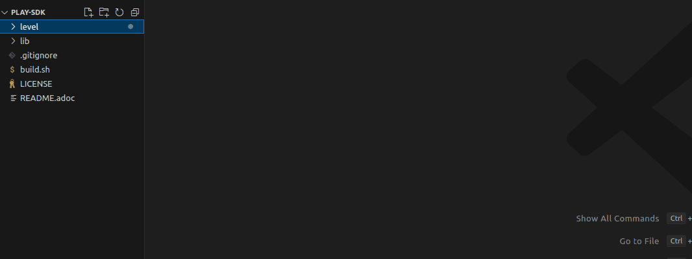
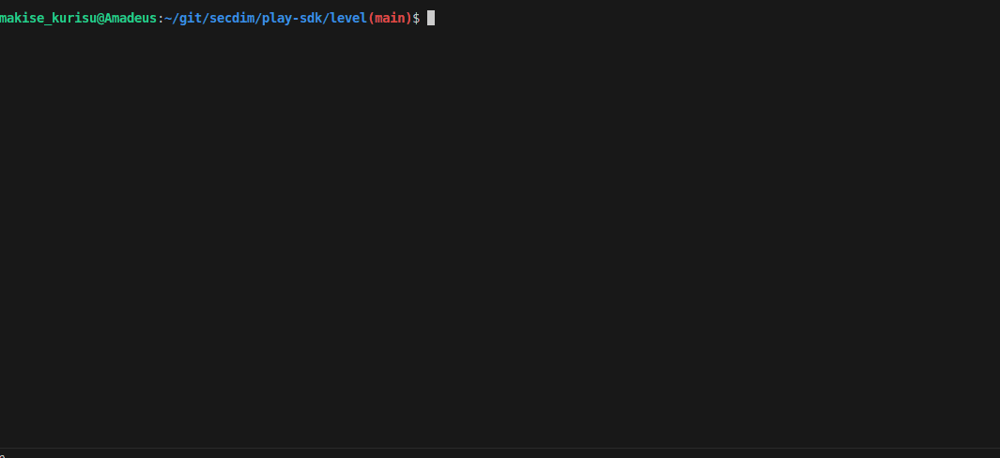
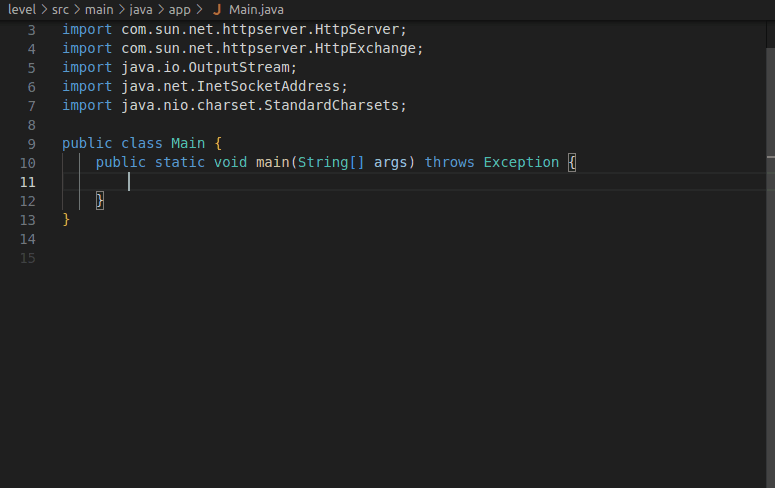
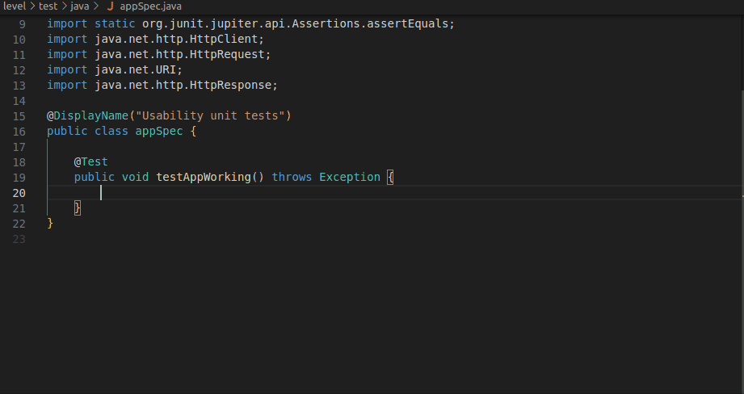
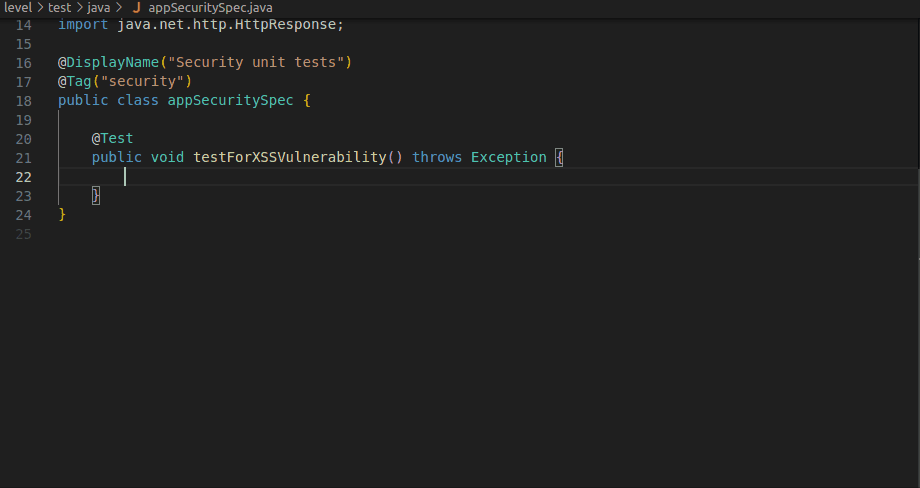
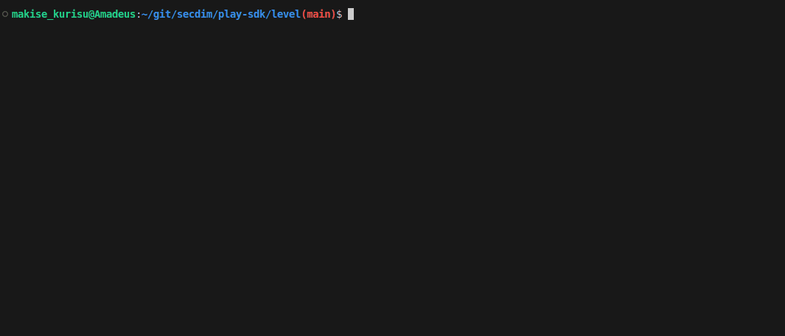

= SecDim Play Level Builder ⚒️

SecDim Play is a novel platform for learning AppSec the fun way through secure programming challenges. 

We have a community-driven approach which offers an interactive way to learn, experiment, and enhance ones AppSec expertise.

This SDK is for creating secure programming challenges. Creating them is a straightforward process. Each challenge is an application, that has a deliberate security vulnerability which the player needs to identify and patch. 

These levels are equipped with two kinds of tests:

1. **Usability Tests** 📋: These tests define the functionality of the application. They are always provided to the player and are designed to pass, reinforcing the importance of maintaining functionality while addressing security issues.

2. **Security Tests** 🛡: Tailored to the level's difficulty, these tests function as a scripted hacking attempt to exploit the security flaw in question. They are designed to fail by default, passing only when the vulnerability has been patched.

This framework allows us to create a variety of secure programming challenges, which are then made available on Play for the community to challenge themselves with. 

The aim is to foster greater ownership of one's code as well as instilling a defensive programming mentality in developers to help them write better & more secure code.

Helpful SecDim Resources:

  - link:https://play.secdim.com[Play] 🎮: Fix security vulnerabilities and get a score
  - link:https://learn.secdim.com[Learn] 📖: Learn about security vulnerabilities and how to fix them
  - link:https://discuss.secdim.com[Discuss] 💬: A community forum for collaborative discussion with like minded AppSec Devs
  - link:https://play.secdim.com/browse[Lab] 🧪: Explore and experiment with existing vulnerabilities

== Pre-requisites

Fork and clone this repository.

Install https://docs.docker.com/get-docker/[docker] and https://www.gnu.org/software/make/[make]
and development environment for the language that you are going to
build a level.

== Initialise

image::res/init.gif[Initialize the SDK]

To get the SDK, in a terminal, run `./build.sh`, then select `init` and enter a language.

This will create a directory called `level` with
a *sample vulnerable app and test suites*.

Currently supported languages are:

`python`, `go`, `typescript`, `javascript`,
`C# (csharp)`, `java`, `solidity`

== Create a private repository

Create a private repository on github and clone it.

[source,bash]
----
cd ../
git clone github.com/my-user/my-private-repo
----

From SDK copy the `level` directory and `build.sh` to your private
repository.

[source,bash]
----
cp -r ../sdk/level .
cp ../sdk/build.sh .
cd level/
----

== Getting Started

. Review the code and tests in `src/` directory.
. Refactor it to introduce a security bug:
.. Remove the sample security bug, usability and security tests.
.. *You can completely refactor the app and tests*.
. You can add a new functionality or modify existing functionalities.
.. Add a usability test for new or modified functionalities.
. Add security test for your bug
.. Remember your bug must be a security vulnerability.

=== Helpful commands:
. `make build` To build the app's container image.
. `make run` to run the container.
. `make test` to run the usabiity tests.
. `make securitytest` to run security tests. Security tests fail because sample app has a security bug. This is intended.
. `make debug` give a shell from container and maps `src` directory from host to the container.

TIP: Looking for an idea? https://cwe.mitre.org/top25/archive/2022/2022_cwe_top25.html[CWE Top 25] or https://semgrep.dev/r[SemGrep Registry] have sample codes with security bugs.

== Introducing a security bug 💀

By default, the SDK comes with an app that has a numeric overflow vulnerability. Using this as an example, you can implement your own app with your own novel take on a security vulnerability.

This can be an entirely different vulnerability, or a reimagining of an existing one.

You can remove the existing app and implement your own application, you are free to use other dependencies but be sure to include them in the gradle. 

The patch for your security vulnerability must be native, meaning the fix should not depend on an external package but should be implemented completely with the base packages of the language itself.

== Add usabiity test(s) 📋

To ensure your application is working as intended, and that any security patch doesn't break the core functionality, you will need to define usability tests.

These tests define the core functionality of your application. You can use the default tests as a reference and implement your own based on the features of your app.

**These tests must always pass by default**, as failing them implies the application has been broken.

== Add security test(s) 🛡

With our challenge app ready, we will now need to simulate an exploitation of the vulnerability in question. 

We do this through security test(s), where we write a scripted hack that tests for the security bug.

**These tests must fail by default**, since this is what is required by the player to address. As in the security vulnerability must be patched for the tests to pass.

Once you have implemented this, you can see your security tests and app in action.

. Test title should include what is tested and what is expected: `test_whenAmountisIntMax_shouldThrowRangeErrorException`
. `make build && make securitytest` to run security tests. They should fail.

== Creating a patch 🩹

Finally we will create a patch for the security bug. 

Start by making a separate branch for the patch:

. `git checkout -b patch` to create a patch branch
. Patch the program
. `make build && make test && make securitytests` to run all tests. They should pass.

NOTE: This patched branch will NOT be provided to the players and
it is only used to verify if level is solvable.

== Verify 🔎

* [ ] `./build.sh` > `verify`: to verify if everything is okay
* [ ] Update `level/Readme.adoc` (NOT this file!) with a level story/incident, level and any pre-requisites.
* [ ] Remove unnecessary files and directories

== Push

git push both `master` and `patch` branches.

[source,bash]
----
git push
git push -u origin patch
----

Add `pi3ch` as one of the contributers/collaborators to your private repository.
A friendly SecDim team member will review your level
and will be in touch for the next step.

*Done!* 🎉

== Important notes

. Remember to push both `master` and `patch` branches.
. *Usability tests* must always pass in both `master` and `patch` branches.
. *Security tests* must pass in `patch` branch but fail in `master` branch.

== Troubleshooting

Ask your question on https://discuss.secdim.com[SecDim Discuss]

= Rewards 🎁

To incentivize the creation of these challenges and promote the adoption of secure programming, we offer numerous rewards to those with successful submissions.

- If your challenge is approved, we will host it on SecDim Play with due credit to you as the author, refer to the License agreement
- You are granted double points for the challenge, this adds to your score on the link:https://play.secdim.com/hall-of-fame[SecDim Leaderboards]

Furthermore, you will be eligible for SecDim Credit in the form of:

- Discounts for professional memberships that can stack into free subscriptions.
- SecDim Signed Digital Badges for our high achievers, these badges boost your CV.
- Early access to our new features, challenges and content.
- Professional Development and experience to improve your employability both with us and in the industry.

Best of Luck with your AppSec Journey!

image::https://play.secdim.com/static/media/logo.84184ff1.ab3f295f.svg[SecDim Play Logo, 200, 200]
