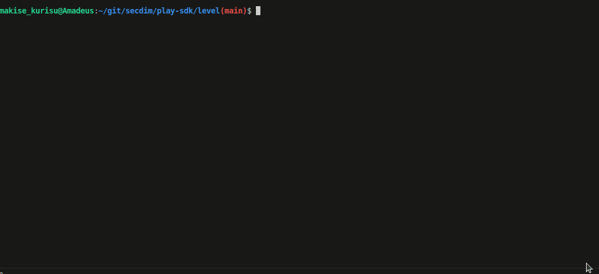

= SecDim Play Level Builder

https://play.secdim.com[SecDim Play] is a novel platform for learning AppSec the fun way through secure programming challenges. 

We have a community-driven approach which offers an interactive way to learn, experiment, and enhance ones AppSec expertise.

This SDK is for creating secure programming challenges. Creating them is a straightforward process. Each challenge is an application, that has a deliberate security vulnerability which the player needs to identify and patch. 

These levels are equipped with two kinds of tests:

1. **Usability Tests**: These tests define the functionality of the application. They are always provided to the player and are designed to pass, reinforcing the importance of maintaining functionality while addressing security issues.

2. **Security Tests**: Tailored to the level's difficulty, these tests function as a scripted hacking attempt to exploit the security flaw in question. They are designed to fail by default, passing only when the vulnerability has been patched.

This framework allows us to create a variety of secure programming challenges, which are then made available on https://play.secdim.com[SecDim Play] for the community to challenge themselves with. 

The aim is to foster greater ownership of one's code as well as instilling a defensive programming mentality in developers to help them write better & more secure code.

== Step 1: Pre-requisites

Fork and clone this repository.

Install https://docs.docker.com/get-docker/[docker] and https://www.gnu.org/software/make/[make]
and development environment for the language that you are going to
build a level.

== Step 2: Initialise

image::res/init.gif[Initialize the SDK]

To get the SDK, in a terminal, run `./build.sh`, then select `init` and enter a language.

This will create a directory called `level` with
a *sample vulnerable app and test suites*.

Currently supported languages are:

`python`, `go`, `typescript`, `javascript`,
`C# (csharp)`, `java`, `solidity`

== Step 3: Create a private repository

Create a private repository on github and clone it.

[source,bash]
----
cd ../
git clone github.com/my-user/my-private-repo
----

From SDK copy the `level` directory and `build.sh` to your private
repository.

[source,bash]
----
cp -r ../sdk/level .
cp ../sdk/build.sh .
cd level/
----

== Step 4: Add a security bug

image::res/run.gif[Initialize the SDK]

In this task you will modify the sample app to introduce a security bug.

. `make build` To build the app's container image.
. `make run` to run the container.
. `make test` to run the usabiity tests.
. `make securitytest` to run security tests. Security tests fail because sample app has a security bug. This is intended.
. `make debug` give a shell from container and maps `src` directory from host to the container.

To begin:

image::res/inspect.gif[Initialize the SDK]

. Review the code and tests in `src/` directory.
. Refactor it to introduce a security bug:
.. Remove the sample security bug, usability and security tests.
.. *You can completely refactor the app and tests*.
.. You can add a new functionality or modify existing functionalities.

.. Add a usability test for new or modified functionalities.
.. Remember your bug must be a security vulnerability.

TIP: Looking for an idea? https://cwe.mitre.org/top25/archive/2022/2022_cwe_top25.html[CWE Top 25] or https://semgrep.dev/r[SemGrep Registry] have sample codes with security bugs.

== Step 5: Add security test(s)

image::res/build.gif[Initialize the SDK]
image::res/securitytest.gif[Initialize the SDK]

In this task you will add security test(s) to test for the security bug

. Test title should include what is tested and what is expected: `test_whenAmountisIntMax_shouldThrowRangeErrorException`
. `make build && make securitytest` to run security tests. They should fail.

== Step 6: Create a patch

In this task you will create a patch for the security bug.

. `git checkout -b patch` to create a patch branch
. Patch the program
. `make build && make test && make securitytests` to run all tests. They should pass.

NOTE: This patched branch will NOT be provided to the players and
it is only used to verify if level is solvable.

== Step 7: Verify

* [ ] `./build.sh` > verify: to verify if everything is okay
* [ ] Update `level/Readme.adoc` (NOT this file!) with a level story/incident, level and any pre-requisites.
* [ ] Remove unnecessary files and directories

== Step 8: Push

git push both master and `patch` branches.

[source,bash]
----
git push
git push -u origin patch
----

Add `pi3ch` as one of the contributers/collaborators to your private repository.
A friendly SecDim team member will review your level
and will be in touch for the next step.

*Done!*

== Important notes

. Remember to push both `master` and `patch` branches.
. *Usability tests* must always pass in both `master` and `patch` branches.
. *Security tests* must pass in `patch` branch but fail in `master` branch.

== Troubleshooting

Ask your question on https://discuss.secdim.com[SecDim Discuss]
