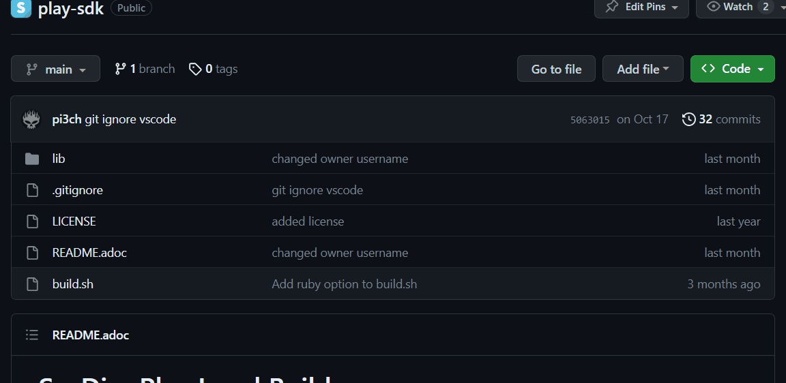
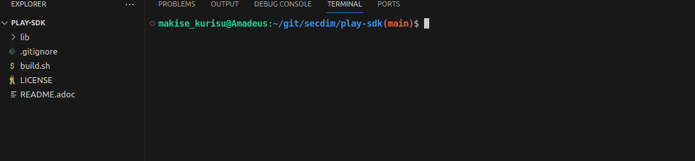

= SecDim Play Challenge Builder ⚒️

SecDim Play is a novel platform for learning how to find, hack and fix security vulnerabilities through wargames. 

We host community challenges publically on our platform for free to foster growth in the security and developer communities.

This SDK is for creating wargame challenges. Creating them is a straightforward process. Each challenge is an application, that has a deliberate security vulnerability which the player needs to identify and patch. 

These challenges comes with two kinds of tests:

1. **Usability Tests** 📋: These tests define the functionality of the application. They are always provided to the player and are designed to pass, reinforcing the importance of maintaining functionality while addressing security issues.

2. **Security Tests** 🛡: Tailored to the level's difficulty, these tests function as a scripted hacking attempt to exploit the security flaw in question. They are designed to fail by default, passing only when the vulnerability has been patched.

== Step 1: Getting Started

Fork this repository and start your GitHub Codespace

TIP: You can also set this up locally on your workstation. Install https://docs.docker.com/get-docker/[docker] and https://www.gnu.org/software/make/[make]
and follow along the rest of the guide.

To get the SDK, in a terminal, run `./build.sh`, then select `init` and enter a language.

This will create a directory called `level` with
a *sample vulnerable app and test suites*.

^ Add to the GIF so it not only initializes the app but you also open it to see the src files and directory

// image::res/inspect.gif[Inpsecting the src files]
Take a look at the level folder, this contains your application. 
The `src/` directory will contain the main application along with the two aforementioned tests. 
Depending on the language the tests are either in the same `src/` directory or in a separate `test/` directory.

== Step 2: Introducing a vulnerability 💀

By default, the SDK comes with an app that has a numeric overflow vulnerability. Using this as an example, you can implement your own app with your own novel take on a security vulnerability.
This can be an entirely different vulnerability, or a different take on an existing one. You can completely refactor or even remove the app and implement your own functionality instead.

TIP: Looking for an idea? https://cwe.mitre.org/top25/archive/2022/2022_cwe_top25.html[CWE Top 25] or https://semgrep.dev/r[SemGrep Registry] have sample codes with vulnereabilities.

You can use the following commands to build, run and test your app:

. `make build` To build the app's container image.
. `make run` to run the container.
. `make test` to run the usabiity tests.
. `make securitytest` to run security tests. Security tests fail because sample app has a vulnerability. This is intended.
. `make debug` give a shell from container and maps `src` directory from host to the container.

In the following example we refactor the existing application to introduce a XSS vulnerability instead:

[source, java]
----
    @RequestMapping(value = "/sayHello", method = RequestMethod.GET)
    public static ResponseEntity sayHello(@RequestParam(name="name",required=false) String name) throws Exception {
        if(name == null || name.equals("")){
            return new ResponseEntity<>("Tell me who to say hello? e.g. /sayHello/?name=alice", HttpStatus.OK);
        }
		return new ResponseEntity<>("<h1>Hello, "+username+"</h1>" , HttpStatus.OK);
    }
----

== Step 3: Add usabiity test(s) 📋

To ensure your application is working as intended, and that the player's security patch doesn't break the core functionality, you will need to define usability tests.

These tests are a specification for your application functionalities. You can use the default tests as a reference and implement your own based on the functionalities of your app.

**These tests must always pass by default**, as failing them implies the application has been broken.

The following is an example of usability tests for the example XSS application:

[source, java]
----
    @Test
    public void test_should_say_hello() throws Exception {
        this.mockMvc.perform(get("/sayHello").param("name", "John"))
        .andExpect(status().isOk()).andExpect(content().string(containsString("Hello, John")));
    }

    @Test
    public void test_when_request_status_should_return_200() throws Exception{
        this.mockMvc.perform(get("/status")).andExpect(status().isOk());
    }
----

== Step 4: Add security test(s) 🛡

With our challenge app ready, we will now need to simulate an exploitation of the vulnerability in question. 

We do this through security test(s), where we write a scripted hack that tests for the vulnerability.

**These tests must fail by default**, since this is what is required by the player to address. As in the security vulnerability must be patched for the tests to pass.

The following is an example of a security test for the example XSS application:

[source, java]
----
    @Test
    public void test_sayHello_shouldEscapeHtmlResponse() throws Exception {
        this.mockMvc.perform(get("/sayHello").param("name", ""))
        .andExpect(status().isOk()).andExpect(content().string(containsString("&lt;script&gt;alert(1)&lt;/script&gt;")));
    }
----

Once you have implemented this, you can see your security tests and app in action.

. Test title should include what is tested and what is expected: `test_whenAmountisIntMax_shouldThrowRangeErrorException`
. `make build && make securitytest` to run security tests. They should fail.

// image::res/build.gif[Building the application]
// image::res/securitytest.gif[Running the security tests for the application]
< Put GIF of the XSS.java Security test running >

== Step 5: Creating a patch 🩹

To ensure the challenge is solvable, we will need to create a patch for the vulnerability. 

Start by making a separate branch for the patch:

. `git checkout -b patch` to create a patch branch
. Patch the program
. `make build && make test && make securitytests` to run all tests. They should pass.

NOTE: This patched branch will NOT be provided to the players and
it is only used to verify if the level is solvable.

The patch for your security vulnerability must not use any new dependencies, meaning the fix should only use existing dependencies.

== Step 6: Verify 🔎

* [ ] `./build.sh` > `verify`: to verify if everything is okay
* [ ] Update `level/Readme.adoc` (NOT this file!) with a level story/incident, level and any pre-requisites.
* [ ] Remove unnecessary files and directories

== Step 7: Push

git push both `master` and `patch` branches.

[source,bash]
----
git push
git push -u origin patch
----

Add `pi3ch` as one of the contributers/collaborators to your private repository.
A friendly SecDim team member will review your level
and will be in touch for the next step.

*Done!* 🎉

== Important notes

. Remember to push both `master` and `patch` branches.
. *Usability tests* must always pass in both `master` and `patch` branches.
. *Security tests* must pass in `patch` branch but fail in `master` branch.

== Troubleshooting

Ask your question on https://discuss.secdim.com[SecDim Discuss]

= Rewards 🎁

We offer numerous rewards to those with successful submissions.

* If your challenge is approved, we will host it on SecDim Play with due credit to you as the author, refer to the License agreement
* You are granted double points for the challenge, this adds to your score on the link:https://play.secdim.com/hall-of-fame[SecDim Leaderboards]

Furthermore, you will be eligible for SecDim Credit in the form of:

* Discounts for professional memberships
* SecDim Digital Badges for our high achievers, you can view this on your public SecDim Profile
* Early access to our new features, challenges and content.

Happy Patching!

== Helpful SecDim Resources:

  - link:https://play.secdim.com/browse[Lab] 🧪: Explore and experiment with existing vulnerabilities
  - link:https://play.secdim.com[Play] 🎮: Fix security vulnerabilities and get a score
  - link:https://learn.secdim.com[Learn] 📖: Learn about security vulnerabilities and how to fix them
  - link:https://discuss.secdim.com[Discuss] 💬: A community forum for collaborative discussion with like minded AppSec Devs

image::https://play.secdim.com/static/media/logo.84184ff1.ab3f295f.svg[SecDim Play Logo, 200, 200]
